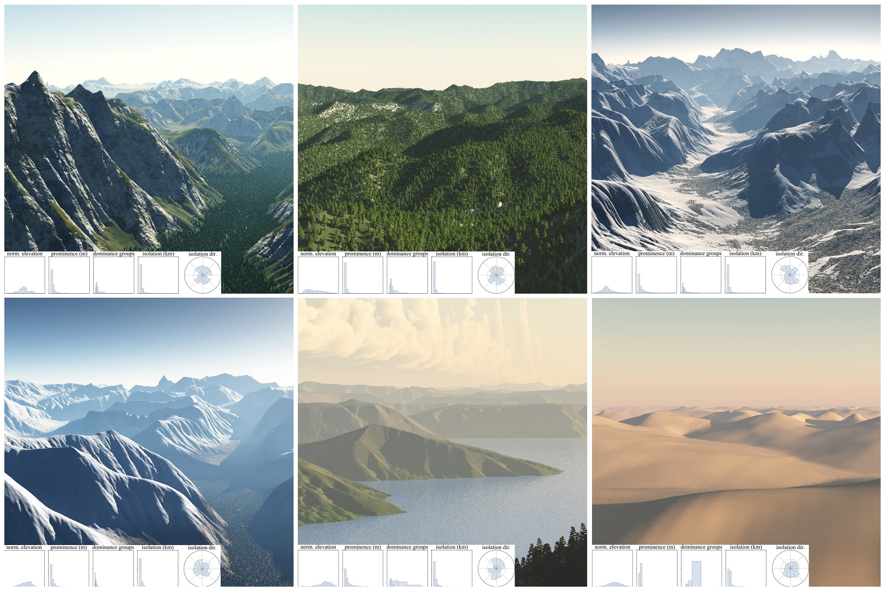

# Orometry-based Terrain Analysis and Synthesis

Given a terrain example, the used method analyses different metrics related to its peaks and saddles graph (the Divide Tree), and then automatically synthesizes a heightfield conforming to these statistics.

I am not the original author, but I did rewrite the author's original code to make it usable for my project. Check out the original author's paper at the end of this readme!

## runnig the code

pip3 install requirements .txt

check the original authors' repository and the .txt files in data, there is a link to a google drive document containing peaks and isolines (?) for earth. That's necessary input, everything else is more or less hardcoded in the main .py files.

if you have downloaded and replaced the input files execute in this order:

```
Analysis.py
Synthesis.py
TerrainFromDivtree.py
```

It should just work and produce an .obj file.

If you want to change which region is analysed and reproduced, take a look at the different, and either a different predefined region or make your own, the .shp files are xml files containing lat long descriptions of polygons on earth. I have not found a software that you can easily draw them with, but that should not be a big blocker to you.

## Remarks, improvements, and to-do

I converted the original jupyter notebooks and encapsulated what I could.

There are some left overs of (imo) unnecessary file I/O that may be nice for experimenting, but aren't strictly required and probably slow down the execution overall.

There is also the original verification code included which I don't really need, I'm pretty happy with the result and that's good enough for me. Who when I will cut that.

## big to-do

The original work works and produces an impressive result. But the output is not "production ready" for me, because there are problems at the edges of the generated .obj (which is normal for the approach they have chosen) and more importantly, I want to blend mountain and terrain types, and/or produce compatible pieces in neighboring tiles.

That's not possible out of the box and probably something I will work on.

# original work

## Article

The article is published in [ACM Transactions on Graphics](https://doi.org/10.1145/3355089.3356535), and can also be read [here](https://hal.archives-ouvertes.fr/hal-02326472/document).

Check also the supplementary material [here](https://dl.acm.org/ft_gateway.cfm?id=3356535&type=zip&path=%2F3360000%2F3356535%2Fsupp%2Fa199%2Dargudo%2Ezip&supp=1&dwn=1).

If you use this code for your research, please cite the author's paper:
```
@article{Argudo2019orometry,
    title = {Orometry-based Terrain Analysis and Synthesis},
    author = {Argudo,Oscar and Galin,Eric and Peytavie,Adrien and Paris,Axel and Gain,James and Gu\'{e}rin,Eric},
    journal = {ACM Transactions on Graphics (SIGGRAPH Asia 2019)},
    year = {2019},
    volume = {38},
    number = {6}
}
```

## Acknowledgements

* Christian Hill for the [Poisson Disc sampling code](https://scipython.com/blog/power-spectra-for-blue-and-uniform-noise/), which the authors originally copied into [utils.poisson](./utils/poisson.py).

* Andrew Kirmse for sharing his result datasets of world prominences and isolations, as well as the to compute these metrics. Check out [his repository](https://github.com/akirmse/mountains).
